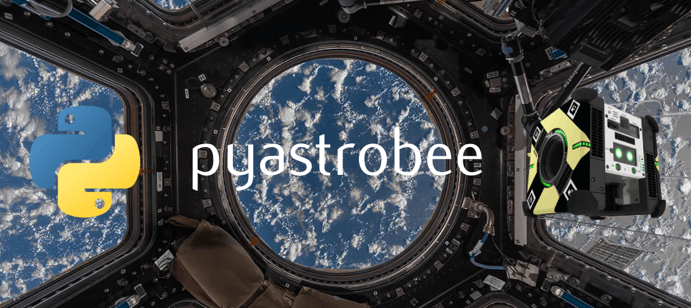

# Pyastrobee: A space robotics simulation environment in Python

## Documentation

[The full documentation can be accessed here](https://danielpmorton.github.io/pyastrobee)

The "helpful notes" pages can be found on the sidebar of this site, as well as in this readme. For the code documentation, expand the **Reference** section in the sidebar and explore each module in the drop-down menus. Alternatively, search for a specific keyword with the searchbar above.

We use Portray to build the documentation. Note: if you'd like a local copy of the documentation with the most up-to-date information, run `portray in_browser` in the main repo folder.

## Helpful notes:

[Getting Started](docs/getting_started.md): Setting up the repository

[Additional Installs](docs/additional_installs.md): Additional installs important for working with the project

[Loading ISS Meshes](docs/loading_iss_meshes.md): Dealing with complex meshes and textures in Pybullet

[Re-texturing](docs/retexturing.md): How to modify Astrobee meshes to load the URDF with a single texture file

[Meshing](docs/meshing.md): Tips on creating new (triangular) meshes to load into Pybullet

[Tetrahedral Meshing](docs/tet_meshing.md): How to generate and modify tetrahedral meshes for soft bodies

[Bag Dynamics](docs/bag_dynamics.md): Some notes on defining mass/inertia values of the cargo bag

[Using NASA's simulator](docs/nasa_sim.md): Helpful commands and installation debugging (optional)

[Assorted Pybullet tips](docs/pybullet_tips.md): Important notes that might not be clear from the quickstart guide

[References](docs/references.md): Links to hepful resources


## Citation

If this repo was helpful in your research, please consider citing the following [paper](https://arxiv.org/abs/2505.01630):

```
@article{morton2025astrobee,
  author = {Morton, Daniel and Antonova, Rika and Coltin, Brian and Pavone, Marco and Bohg, Jeannette},
  title = {Deformable Cargo Transport in Microgravity with Astrobee},
  year = {2025},
  journal = {arXiv preprint arXiv:2505.01630},
  note = {Submitted to RSS Space Robotics Workshop, 2025},
}
```
