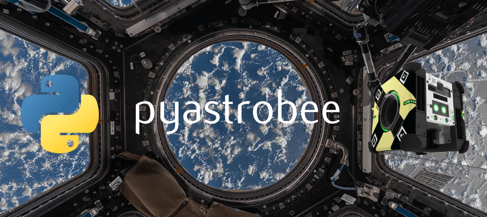

# Pyastrobee: A space robotics simulation environment in Python

## Documentation Overview
[Getting Started](docs/getting_started.md): Setting up the repository

[Loading ISS Meshes](docs/loading_iss_meshes.md): Dealing with complex meshes and textures in Pybullet

[Assorted Notes](docs/assorted_notes.md): Things I thought seemed important

[Testing](docs/testing.md): Information about running test cases

[References](docs/references.md): Links to hepful resources

## Status
### TODOs:
- [ ] Improve waypoints in demo, clean up script
- [ ] See if the quaternion rotations between motions needs to be debugged (seems like it rotates in odd ways sometimes?)
- [ ] Add some notes about using the keyboard controller somewhere
- [ ] Implement force control / velocity control 
- [ ] Make the debug visualizer camera position an input in `initialize_pybullet` so we can start the visualization inside the ISS
- [ ] Move info about working with the NASA ROS sim out of "Assorted Notes" and into its own page in docs
- [ ] Finish cleanup of Astrobee() code
  - [ ] Figure out timesteps, tolerances, step parameters
  - [ ] Figure out if the while loops shuold be moved somewhere else
  - [ ] Clear out a bunch of the random TODOs
- [ ] Delete the constraint_test file, but only after messing around with some of the other parameters they used
  - [ ] Additional parameters in createConstraint, changeConstraint (maxForce?)
  - [ ] setRealTimeSimulation()?
- [ ] Get a softbody anchor working between the astrobee gripper and the bag
- [ ] Look into some of the other modules in pytransform3d like urdf, camera, ...
- [ ] See if we can use the RPBI to plan the path in ROS, then communicate the constraint info back to pybullet
- [ ] Add threading once commands get too complicated
- [ ] Test out soft contact forces in an old build of Bullet (or old pybullet version in new pyenv) 
  - [ ] https://github.com/bulletphysics/bullet3/issues/4406
- [ ] Debug loading the texture for Astrobee
  - [ ] Did the DAE -> OBJ conversion go wrong? Things look like they might be in the wrong place
  - [ ] Is is just the texture image? If we're only applying one texture image, maybe the UVmap for some parts aren't realistic for that image
  - [ ] Move the modified Honey skin file into the correct place (not `imgs/`)
- [ ] See if I can load the astrobee like Erwin did with atlas: https://github.com/erwincoumans/pybullet_robots/tree/master/data/atlas
  - [ ] Check out the assimp library he mentioned in the commit message as well
  - [ ] Figure out what the deal is with some of the gripper links disappearing
- [ ] Decide if the *exact* positioning of the ISS needs to match Gazebo, and if so, update meshes and blender file
- [ ] Fix the `setup.py` so that it actually installs pybullet after numpy/wheel
- [ ] Reorganize the `resources/` folder (obsolete?)
- [ ] Decide if we need to modify/refine the VHACD results based on what's important to us
- [ ] Check if pyenv messes with the nasa ROS commands like the conda env did
- [ ] Set up camera (see dedo)
- [ ] Set up pointcloud (see dedo)
- [ ] Try a manifold mesh with the handle being solid
- [ ] Try out FEM deformables?
- [ ] Try out adding a small anchor object to the handle - see dedo anchor utils. Make it a small nonzero mass
- [ ] Try flipping all of the face normals on the non-manifold mesh
- [ ] Work on improving bag meshes
- [ ] Try out remeshing only half of a bag to see if a denser mesh in an area will give different properties in Bullet
- [ ] Organize meshes
- [ ] Send cargo bag properties to ROS
- [ ] Get Astrobee ROS/simulation processes working in Pybullet
- [ ] Figure out how to send robot state from bullet to ROS
- [ ] Add more tests

### In Progress:
- [ ] Get demo script started for Rika
- [ ] Move things over to workstation 7 - set up NASA resources on that too
- [ ] Get correct physical properties for cargo bag (check on weird inertia?)

### Backlog/Optional:
- [ ] Make other environments loadable from astrobee_media (Granite lab, ...)
- [ ] Figure out a better way of generating the astrobee/iss URDF with less manual modifications
- [ ] If there is a need for multiple bullet clients in the future, add the "sim" parameters back in from dedo
- [ ] Add in debugging and exception handling
- [ ] Consider using pathlib Path with str(Path(filename))?
- [ ] See if it is possible to get URDFs working with multiple textures
- [ ] Figure out if it's possible to load arbitrary meshes into mujoco

### Done:
- [X] Load the astrobee inside the new ISS model just to confirm it works ok collision-wise
- [X] Quaternion test cases (functions + class)
- [X] Rotate the ISS so it's flat
- [X] Simple motion/trajectory planning
- [X] Integrate new pose and transformation code into astrobee class
- [X] Switch over to pytransform3d for rotations/transformations
- [X] Understand which joint indices on the astrobee correspond to which locations (and which are fixed / not usable)
- [X] Figure out a way to move the astrobee in space (not via controlling a joint)
- [X] Get a feel for how pybullet controls robot links. Write helper functions to control joints
- [X] Completely remove the astrobee_media submodule and any reference to it?
- [X] Reduce the amount of hardcoded directory/file locations (especially absolute paths)
- [X] Figure out how to work with relative file paths in the urdf/xacro/xml files
- [X] Load the ISS with all textures applied
- [X] Load the astrobee URDF
- [X] Change pybullet version back to most recent in the pyenv astrobee env?
- [X] Change repo name (and name of all local folder systems) to pyastrobee
- [X] Remove all absolute filepaths, and make sure any external resources are made available in this repo so that it can work on multiple computers
- [X] Rename the new meshes folder to iss_meshes?
- [X] Get the inertial properties for the base link updated
- [X] Debugged weird collapsing/exploding/stuttering issues with the cargo bag meshes
- [X] Add info to readme about setting up the submodule
- [X] Import ISS modules with textures
- [X] Try loading the iss as multiple objs (with the texture files)
- [X] Solve the Cupola/Node 1 mesh issues
- [X] Switch from conda to pyenv
- [X] Try out pybullet 3.1.7 to see if this is more stable at all
- [X] Try out MuJoCo
- [X] Merge in Dedo utility functions
- [X] Import Dedo bag assets
- [X] Create cargo bag URDF and import into Pybullet
- [X] Simplify/improve cargo bag mesh (try a thin mesh handle?)
- [X] Set up repository and packaging
- [X] Import Astobee resources into Pybullet
- [X] Fix the ISS interior collisions with V-HACD
- [X] Model cargo bag in CAD and export mesh
- [X] Set up virtual environment

### Ask NASA:
- What's the deal with their crazy positioning of the ISS in Gazebo? Why is world frame attached to a random handle in the middle of space?
- What are the dimensions of the cargo bags / measurements for the handles? Do you have any CAD for these?

### Bugs/Issues:
- Some softbodies have very strange inertia when moving them around in the Bullet gui (likely, some parameters need to be refined)

### Thoughts
